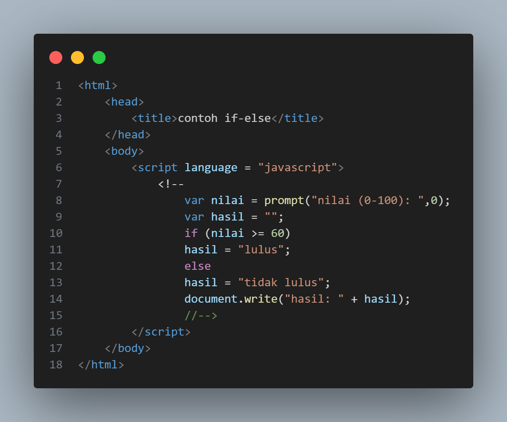
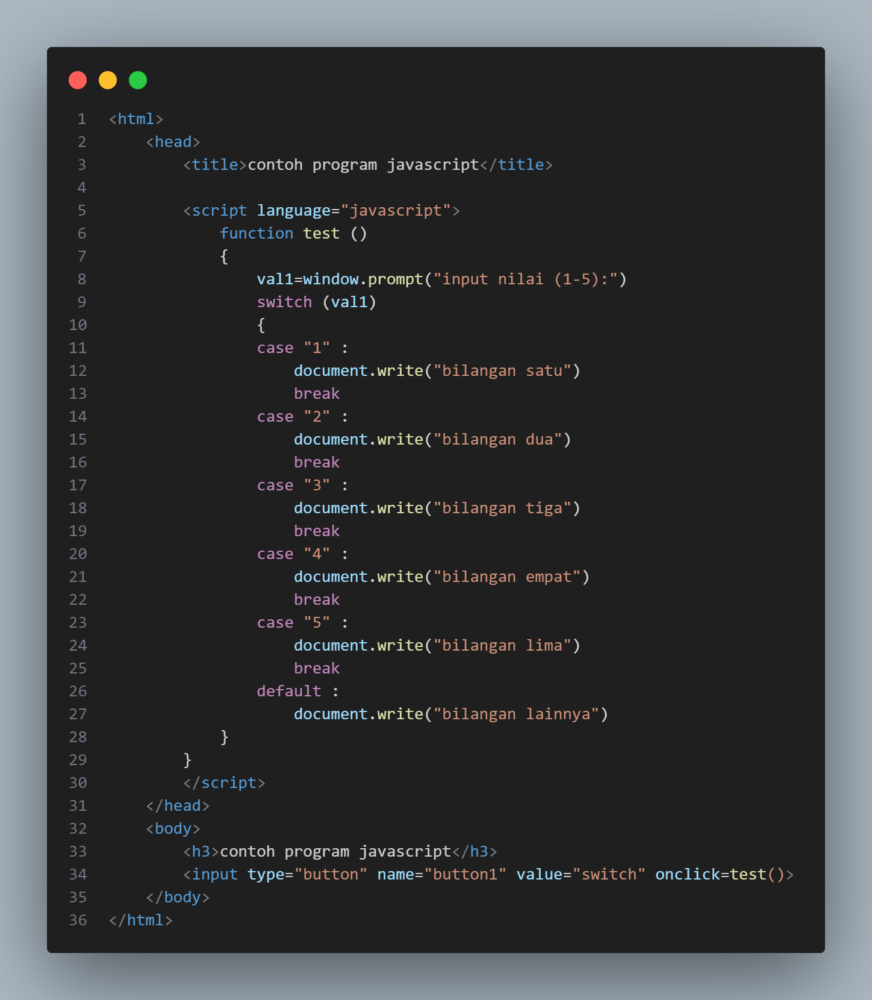
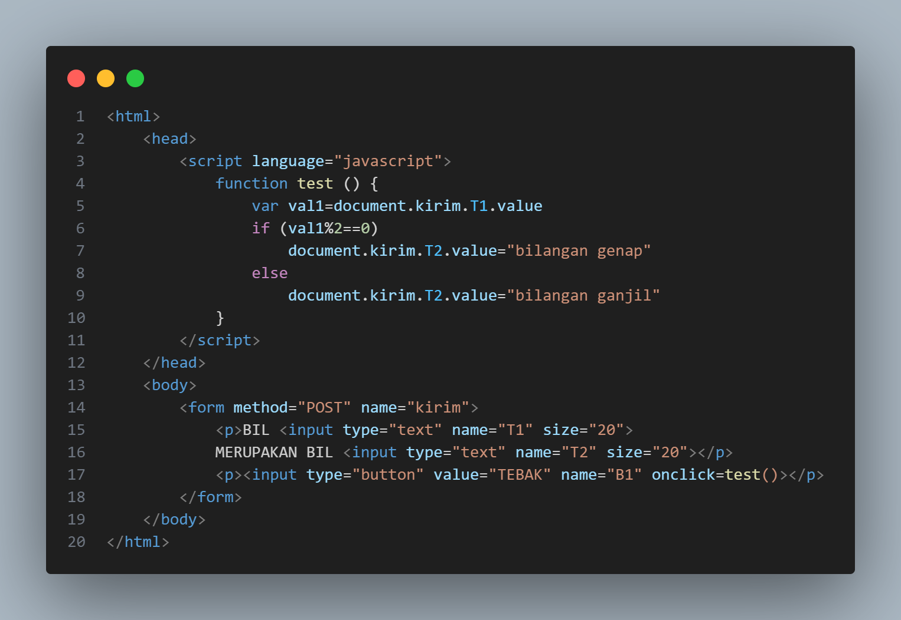

# lab5web
# Nama : Muhammad Din Al Ayubi
# Kelas : TI 22 A3
# NIM : 312210293

## Instruksi Praktikum
1. Persiapkan text editor misalnya VSCode.
2. Buat folder baru dengan nama lab5_javascript.
3. Ikuti langkah-langkah praktikum yang akan dijelaskan berikutnya.
4. Lakukan validasi dokumen html dengan mengakses http://validator.w3.org
## Langkah-langkah Praktikum
* Persiapan membuat dokumen HTML dengan nama file ```lab5_javascript.html```seperti berikut.

* Hasil Output

## Javascrip Dasar
* Pemakaian ```Alert``` sebagai property window.

* Hasil Output

* Pemakaian ```method``` dalam objek.

* Hasil Output

* Pemakaian ```Prompt```

* Hasil Output


* Pembuatan ```fungsi``` dan cara pemanggilannya

## Dasar Pemrograman Di Javascript
* Operasi dasar ```aritmatika```

* Hasil Output

* Seleksi ```kondisi``` (if..else)

* Hasil Output


* Penggunaan ```operator switch``` untuk seleksi kondisi

* Hasil Output


## Pembuatan Form
* Form ```Input```

* Hasil Output


* Form ```Button```

* Hasil Output

## HTML ```DOM```
* Pilihan menggunakan ```checkBox``` dengan perhitungan otomatis

* Hasil Output

## Pertanyaan dan Tugas
1. ```Buat script untuk melakukan validasi pada isian form.```


* Hasil Output


## Laporan Praktikum
1. Buatlah repository baru dengan nama Lab5Web.
2. Kerjakan semua latihan yang diberikan sesuai urutannya.
3. Screenshot setiap perubahannya.
4. Buatlah file README.md dan tuliskan penjelasan dari setiap langkah praktikum beserta
screenshotnya.
5. Commit hasilnya pada repository masing-masing.
6. Kirim URL repository pada e-learning ecampus